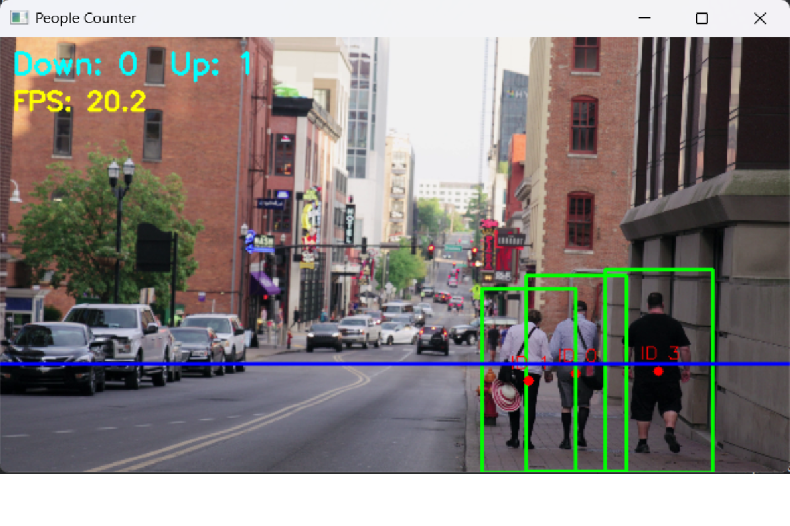

   # Real-Time People Counter

   Detects, tracks, and counts pedestrians in video using classical computer vision,
   running at ~19–22 FPS on CPU.

   

   ## Pipeline
   1. **Detection:** OpenCV's HOG + linear SVM person detector
   2. **Filtering:** confidence, size, and aspect-ratio checks, then non-maximum suppression
   3. **Tracking:** centroid tracker with persistent IDs through short occlusions
   4. **Counting:** each confirmed person is counted once when they cross the line

   ## Run
```bash
   pip install -r requirements.txt
   python people_counter.py --video your_clip.mp4 --line 0.75
```
   `--line` sets the counting line height (0–1). Omit `--video` to use a webcam.

   ## Known limitations
   - HOG can produce false positives on tall static structures (trees, poles)
   - Detections drop during occlusion; the tracker keeps IDs alive for brief gaps
